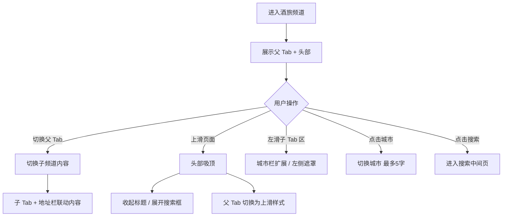

# 酒旅频道父子嵌套 · 产品设计文档

> 来源：[https://3.cn/11gP4q-nW](https://3.cn/11gP4q-nW)  
> Relay 设计稿：[relay.jd.com 设计文件](https://relay.jd.com/file/design?id=1995111991542296577&page_id=108:98183)  
> 页面名称：**🟢1211｜酒旅频道父子嵌套**  
> 文档生成日期：2026-05-20

---

## 1. 项目概述

本设计稿为 **京东旅行 · 酒旅频道** 的父子 Tab 嵌套方案，覆盖推荐、酒店、机票、火车票、景点门票、旅游度假、演出赛事等子频道，并包含吸顶态、左滑态、H5 标题态、搜索中间页、优惠券弹窗等完整交互与视觉规范。

**核心目标：**

- 父级 Tab 承载主品类切换（推荐 / 酒店 / 机票 / 火车票 / 景点门票 / 旅游度假 / 演出赛事等）
- 子级 Tab + 城市地址栏承载频道内细分场景（精选、游玩特惠、特价酒店等）
- 上滑吸顶后强化搜索转化，收起文字标题、展开搜索框

---

## 2. 信息架构

### 2.1 父级频道 Tab

| Tab 名称 | 说明 |
|---------|------|
| 推荐 | 综合推荐首页，含金刚区、瓷片区、瀑布流 |
| 酒店 | 酒店查询与子 Tab（特价酒店、百亿补贴等） |
| 机票 | 机票 Tab，含特价机票、随心飞等入口 |
| 火车票 | 火车票查询、京东抢票、学生票等 |
| 景点门票 | 景点/门票列表与筛选 |
| 旅游度假 | 精选 / 出境度假 / 国内度假 / 签证 |
| 演出赛事 | 演出门票相关页面 |

### 2.2 子级 Tab（以推荐/度假为例）

**推荐频道子 Tab：**

- 精选（选中态 `#0973EC`，下划线 20×2pt）
- 游玩特惠
- 特价酒店
- 低价机票
- 出境必备
- 出境服务

**旅游度假子 Tab：**

- 精选
- 出境度假
- 国内度假
- 签证

**景点门票筛选：**

- 推荐排序、景点类型、区域位置、筛选
- 分类：全部景点、主题乐园、自然风光、温泉滑雪、人文历史

### 2.3 底部导航

| 入口 | 文案 |
|------|------|
| 首页 | 首页 |
| 活动 | 99元机票 |
| 商家 | 商家入驻 |
| 订单 | 订单中心 |
| 我的 | 我的 |

---

## 3. 页面清单

设计稿按模块分区，主要屏幕/状态如下：

### 3.1 方案一（全部子频道 icon）

| 画板 | 尺寸 | 说明 |
|------|------|------|
| 方案1-2 | 375×812 ~ 1502 | 含「全部子频道 icon」展开态 |
| 方案1-2（多状态） | 375×1222 | 不同子频道内容高度 |

### 3.2 方案二（酒店 / 机票 Tab）

| 画板 | 说明 |
|------|------|
| 方案2-酒店 | 多状态：默认、运营弹框、内容滚动 |
| 方案2-机票Tab | 含酒店 tab 联动样式 |
| 酒店tab | Tab 数量 5 个以上，左对齐 |

### 3.3 各品类完整页

| 品类 | 画板名称 | 关键模块 |
|------|----------|----------|
| 景点门票 | 景点门票 | 导航栏、Tab、背景、瓷片+瀑布流、底 bar |
| 旅游度假 | 度假-精选 / 出境度假 / 国内度假 / 签证 | 瓷片+瀑布流、筛选条 |
| 演出 | 演出门票 | 多版本列表态 |
| 火车票 | 火车票 | 查询表单、当地推荐 |
| 机票 | 机票 | 长列表 1149pt |
| 酒店 | 酒店 / 酒店-榜单页 | 榜单、吸顶 |
| 精选 | 精选 / 推荐-吸顶 | 吸顶前后对比 |
| 搜索 | 搜索中间页 | 垂直搜索、缺省态 |
| 运营 | 优惠券弹窗 | 弹窗容器 |
| 缺省 | 缺省状态/半屏缺省 | 240×184 / 190 |

### 3.4 辅助切图与组件

- cross 卡片切图（特价机票、旅游、玩什么等）
- 面性金刚区（490×666 / 796）
- 首页金刚位设计说明 & 切图
- 文字飘新提示
- bannner 运营条

---

## 4. 头部与导航规范

### 4.1 头部标题栏

**默认态（文字标题）：**

- 品牌：**京东旅行**（`jingdonglangzhengti2`，20pt，字重 600，白色）
- 搜索框占位：**北京环球**（13pt，`#505259`，圆角 6，背景 `rgba(255,255,255,0.80)` + 毛玻璃 `blur(2.5px)`）
- 右侧：消息、更多等图标 20×20pt

**交互说明：**

> 上划吸顶后，收起标题，侧重搜索转化，展开搜索框覆盖标题区。

**吸顶态：**

- 收起「京东旅行」文字标题
- 搜索框宽度扩展至约 249pt（`left: 37`），占满标题区
- 保留返回与右侧操作区

### 4.2 H5 标题样式

- 居中标题 **京东旅行**（20pt，`#171A26`，字重 500）
- 搜索框样式与 App 内保持一致

### 4.3 「关注」入口

> 「关注」复用线上样式。

- 文案：关注（12pt 白色）
- 与品牌区并列展示

### 4.4 头部背景切图

- 顶部蓝色渐变背景（主色约 `#0148B3` / `#0049B8`）
- 高度约 162~204pt，需按子频道配置切图

### 4.5 页面上滑 / 左滑遮挡

| 场景 | 说明 |
|------|------|
| 页面上滑后左划遮挡色块切图 | 左缘 85×36 遮挡块，未选中 Tab 胶囊样式 |
| 页面左滑后左划遮挡色块切图 | 子 Tab 左滑时左侧遮罩 |

**父 Tab 示例（上滑未选中）：** 推荐、酒店、机票、火车票、景点门票、旅游度假、演出赛事  

**选中 Tab：** 机票（17pt，`#013B94`，字重 500）

---

## 5. 子 Tab + 地址栏

### 5.1 布局结构

```
[ 城市选择 16pt ] [ 子Tab1 | 子Tab2 | 子Tab3 ... ]  → 可横向滑动
```

- 栏高：**40pt**，背景 `#FDFDFE`
- 左侧城市区：图标 14×14 + 城市名 14pt（`#171A26`，字重 500）
- 子 Tab 间距：**24pt**
- 选中：文案 `#0973EC` 14pt 字重 600 + 下划线 20×2pt
- 未选中：`#1A1A1A` 14pt 字重 400

### 5.2 城市名称规则

| 规则 | 值 |
|------|-----|
| 左侧城市区宽度（常态） | **16pt** |
| 城市 + 箭头区域（常态） | **24pt** |
| 文案 | 最多 **5 字**，超出打点（示例：乌鲁木齐...） |

### 5.3 左滑态

- 城市区域随左滑扩展（示例：137pt 宽遮罩区）
- 子 Tab 整体右移，保持选中「精选」可见

---

## 6. 底部背景与内容区

### 6.1 分层色值

| 层级 | 色值 | 用途 |
|------|------|------|
| 顶部内容区 | `#FFFFFF` | Tab 下方主内容 |
| 中间过渡 | `#FFFFFF` | 瓷片/列表主体 |
| 底部渐变 | `#F5F6FA` | 列表底部过渡 `linear-gradient(0deg, white 0%, #F5F6FA 100%)` |

### 6.2 瓷片区（旅游度假等）

| 属性 | 规范 |
|------|------|
| 卡片尺寸 | 83×87pt |
| 圆角 | 6pt |
| 投影 | `#EBEDF7`，`0 0 10px` |
| 描边 | `#FFFFFF` 1pt |
| 背景渐变 | `radial-gradient(ellipse 58.21% 121.48% at 64.84% 70.58%, #E6F2FF 0%, white 97%)` |
| Icon | **32×32pt** |
| 标题 | 14pt 字重 500，`#1A1A1A` |
| 副标题 | 12pt，`#828794` |

**瓷片示例：**

- 租车包车 / 无忧出发
- 定制游 / 精致定制
- 全球签证 / 省时省心
- 出游必备

---

## 7. 金刚区规范

> 详见画板「首页金刚位设计说明&切图」

| 属性 | 规范 |
|------|------|
| Icon 尺寸 | **24×24pt**（示意区另有 28pt 标注） |
| 选中 Tab Icon | **20×20pt** |
| 上滑子频道 icon | 选中 / 未选中两套 |
| 全部子频道 icon | 选中 / 未选中两套 |
| TAB 态 | 选中态、未选中态、上滑选中态、上滑未选中态 |

**入口示例：**

订酒店、订机票、订门票、百亿补贴、国际酒店、民宿客栈、随心飞、火车、租车、景点门票、游玩特惠、旅游度假、演出赛事、境外上网、春运抢票

---

## 8. 核心业务模块

### 8.1 火车票

- 出发/到达：北京 ↔ 杭州/海口/上海
- 日期：11月04日、今天、10-01 去、10-13 去
- 功能：学生票、京东抢票、我的订单、联系客服、里程兑换、清除
- 当地推荐：预订上海酒店（11-04 住 1晚 11-05 离）

### 8.2 酒店

- 子入口：特价酒店、百亿补贴、国际酒店、民宿客栈
- 列表：酒店卡片（评分、标签、价格、距离）
- 示例：美居/亚朵/桔子水晶等，含「百亿补贴」「PLUS专享」「今日可订」等标签

### 8.3 机票

- 子入口：低价机票、随心飞
- 营销：海航随心飞权益 699元、连住2晚高星酒店 199元（倒计时）
- 航线卡片：北京→青岛/大连，近14日超低价

### 8.4 景点门票

- 搜索：景点/门票
- 列表：泡泡玛特城市乐园、北京环球影城、北京欢乐谷等
- 价格：￥122 起、￥98、￥260 等
- 底部：没有更多了内容了～

### 8.5 旅游度假

- 筛选：包邮、品牌、出发省份/城市/日期
- 商品：超值双人价北京旅游、国内旅游榜第2名、销量800+
- 跟团：新疆跟团游、热门跟团游 TOP 榜单

### 8.6 推荐首页内容

- 倒计时活动块（距结束 / 后结束）
- 京东旅行定制游（1对1私人定制、免费定制行程）
- 酒店/景点/机票/度假混排瀑布流
- 满9减3 等促销标签

---

## 9. 设计令牌（Design Tokens）

### 9.1 颜色

| Token | 色值 | 场景 |
|-------|------|------|
| 品牌蓝 | `#0148B3` / `#0049B8` / `#013B94` | 头部、选中 Tab |
| 主色强调 | `#0973EC` | 子 Tab 选中、下划线 |
| 主文字 | `#171A26` / `#1A1A1A` | 标题、Tab 未选中 |
| 次要文字 | `#505259` / `#828794` | 搜索占位、副标题 |
| 页面背景 | `#F5F6FA` / `#FDFDFE` | 底栏、过渡 |
| 标注绿 | `#33DD7A` | 设计标注尺寸线 |
| 标注红 | `#FF0000` | 间距/尺寸标注 |

### 9.2 字体

| 用途 | 字体 | 字号 | 字重 |
|------|------|------|------|
| 品牌标题 | jingdonglangzhengti2 | 20pt | 600 |
| 区块标题 | PingFang SC | 18pt | 600 |
| 子 Tab 选中 | PingFang SC | 14pt | 600 |
| 子 Tab 未选中 | PingFang SC | 14pt | 400 |
| 父 Tab 选中（上滑） | PingFang SC | 17pt | 500 |
| 说明文字 | PingFang SC | 14pt | 300 |
| 角标/数字 | 975Maru SC | 10~11pt | 500 |

### 9.3 间距与尺寸

| 元素 | 尺寸 |
|------|------|
| 屏幕宽度 | 375pt |
| 状态栏 | 44pt |
| 导航栏 | 44pt |
| 父 Tab 区 | 74pt（5 个以上左对齐） |
| 子 Tab 栏 | 40pt |
| 底 bar | 80pt |
| 金刚 icon | 24×24pt / 选中 20×20pt |
| 瓷片 icon | 32×32pt |

---

## 10. 关键交互说明



1. **父 Tab 切换**：切换酒店/机票/门票等整页内容与头部背景切图。
2. **上滑吸顶**：标题收起，搜索框放大；父 Tab 使用「上滑选中/未选中」icon 态。
3. **左滑子 Tab**：左侧城市区域变宽，右侧 Tab 横滑，边缘遮罩防止截断。
4. **关注**：复用线上已有组件样式，不做单独改版。
5. **运营弹框**：右下角浮层 + 关闭控件 12×12pt。
6. **缺省态**：半屏缺省 240×190，用于搜索/列表无结果。

---

## 11. 切图与交付清单（摘要）

| 类别 | 内容 |
|------|------|
| 头部 | 各子频道背景切图、上滑/左滑遮挡块 |
| Tab | 父 Tab 选中/未选中/上滑态 icon（20×20、24×24、36×36、44×44） |
| 金刚区 | 面性金刚区全量入口 icon |
| 卡片 | cross 卡片、酒店/景点/机票/度假/演出/签证卡片 |
| 瓷片 | 83×87 瓷片背景与 icon |
| 运营 | banner、文字飘新、优惠券弹窗 |

---

## 12. 附录

### 12.1 链接解析

短链 `https://3.cn/11gP4q-nW` 跳转至 Relay 邀请确认页，目标设计文件：

- **fileKey**: `1995111991542296577`
- **page_id**: `108:98183`
- **node_id**: `108:98183`

### 12.2 统计

- 设计稿内文本节点约 **6700+** 处（含重复实例）
- 主要屏幕画板 **80+** 个（375pt 宽移动端）
- 设计说明面板 **6** 组（头部、子 Tab、底部背景、瓷片区、金刚区等）

---

*本文档由 Relay 设计稿自动提取生成，实施前请以最新 Relay 源文件与产品 PRD 为准。*
